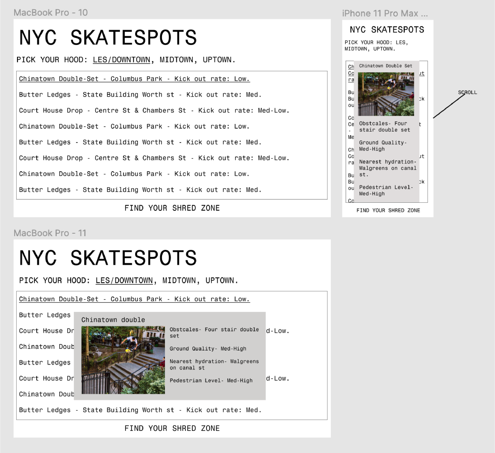

# finalproject

My project is a skate spot finder. So you pick your location and it tells you the spots there, then you can click on the spots and it brings up a photo and some extra info about it.

 
